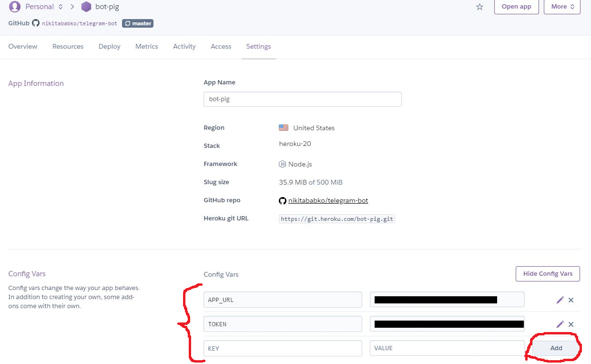

# Telegram test-bot

### Useful links:

- [node-telegram-bot-api documentation](https://github.com/yagop/node-telegram-bot-api)
- [Telegram stickers](https://tlgrm.ru/stickers)
- [Config vars heroku](https://devcenter.heroku.com/articles/config-vars)

### Try bot locally

1. Create your own bot using Telegram's [BotFather](https://core.telegram.org/bots#3-how-do-i-create-a-bot) and grab your TOKEN.
2. Clone or download and unpack this repo.
3. Go to the app's folder using `cd telegram-bot`
4. Run `npm install` or `yarn install`.
5. Rename .env_example file into .env and set TOKEN to the value, you've got from the BotFather.
6. Run `npm start` or `yarn start` and send smth to your bot.
7. After it says "Welcome" to you, we can go to the next step😎

### Deploy your bot to the heroku

1. Create the [Heroku account](https://heroku.com) and install the [Heroku Toolbelt](https://toolbelt.heroku.com/).
2. Login to your Heroku account using `heroku login`.
3. Go to the app's folder using `cd heroku-node-telegram-bot`
4. Run `heroku config:set TOKEN=SET HERE THE TOKEN YOU'VE GOT FROM THE BOTFATHER` and `heroku config:set HEROKU_URL=$(heroku info -s | grep web_url | cut -d= -f2)` or enter them manually into heroku (shown below in the screenshot) to configure environment variables on the server.
5. Run `git add . && git commit -m "Ready to run on heroku" && git push heroku master` to deploy your bot to the Heroku server.
6. Send smth to the bot to check out if it works ok.

  <h3>Screenshot</h3>
  

